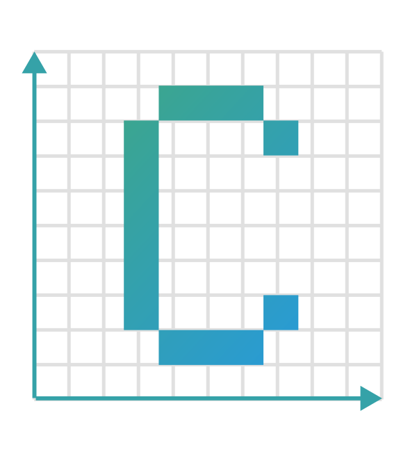

Concord
===

A C++ library for working with geodetic coordinates.

---

## Installation

### CMake

```cmake
find_package(concord REQUIRED)
```

### FetchContent

```cmake
FetchContent_Declare(
  concord
  GIT_REPOSITORY https://github.com/concord-project/concord.git
  GIT_TAG v0.1.0
)
FetchContent_MakeAvailable(concord)
```

---

## Usage

```cpp
#include <concord/Coordinate.hpp>

using namespace concord;

Coordinate<double> coord(0.0, 0.0);

// Convert to UTM
UTM utm = coord.to_utm();

// Convert to Lat/Lon
LatLon latlon = coord.to_latlon();
```

---
