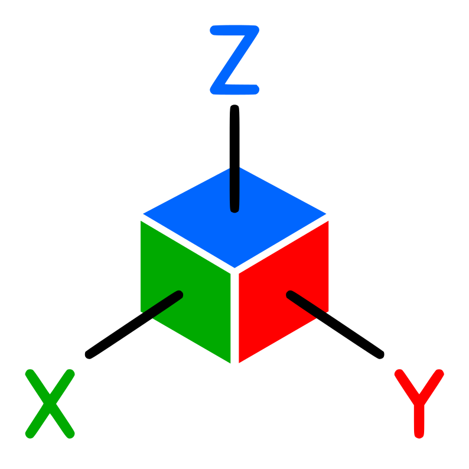

# Concord

A comprehensive C++ library for geodetic coordinate systems, spatial algorithms, and geometric operations with modern architecture.

[](https://github.com/bresilla/concord)
[](LICENSE)
[](https://isocpp.org/)

## Overview

Concord is a modern C++20 library providing a complete suite of tools for geodetic coordinates, spatial data structures, and geometric algorithms. Designed for GIS, robotics, surveying, navigation, and any domain requiring precise spatial computations.

### 🏗️ Modern Architecture

Concord features a clean, modular architecture organized into logical components:

```
concord/
├── core/                    # Foundation components
│   ├── types/               # Basic types (Point, Size, etc.)
│   ├── math/                # Mathematical operations  
│   ├── errors/              # Error handling
│   └── precision/           # Precision handling
├── algorithms/              # Spatial algorithms
│   ├── distance/            # Distance calculations
│   ├── intersection/        # Intersection algorithms
│   ├── convex_hull/         # Convex hull algorithms
│   └── triangulation/       # Triangulation algorithms
├── geometry/                # Geometric shapes
│   ├── primitives/          # Basic shapes (Circle, Line, etc.)
│   ├── polygon/             # Polygon operations
│   └── grid/                # Grid structures
├── geographic/              # Geographic systems
│   ├── crs/                 # Coordinate reference systems
│   ├── transformations/     # Coordinate transformations
│   └── projections/         # Map projections
├── indexing/                # Spatial indexing
│   ├── rtree/               # R-tree implementation
│   ├── quadtree/            # QuadTree implementation
│   └── hash_grid/           # Spatial hash grid
└── builders/                # Fluent APIs
    ├── coordinate_builder.hpp
    ├── geometry_builder.hpp
    └── spatial_builder.hpp
```

### ✨ Key Features

- **🌍 Coordinate Systems**: WGS84, UTM, ENU, ECEF, LTP with fluent transformations
- **🧮 Mathematical Core**: Vectors, matrices, quaternions, transformations  
- **📐 Rich Geometry**: Points, lines, circles, polygons, paths, grids, bounding volumes
- **� Spatial Algorithms**: Distance, intersections, convex hulls, triangulation
- **✂️ Polygon Processing**: Intelligent partitioning based on area, convexity, shape
- **🚀 Spatial Indexing**: R-Trees, QuadTrees, hash grids for efficient queries
- **🎯 Builder Pattern**: Fluent APIs for coordinate transformations
- **⚡ High Performance**: Optimized algorithms with modern C++20 practices

---

## Installation

### CMake Integration

```cmake
FetchContent_Declare(
  concord
  GIT_REPOSITORY https://github.com/bresilla/concord.git
  GIT_TAG        develop
)
FetchContent_MakeAvailable(concord)

target_link_libraries(your_target PRIVATE concord::concord)
```

### Manual Build

```bash
git clone https://github.com/bresilla/concord.git
cd concord
mkdir build && cd build
cmake ..
make -j$(nproc)
```

---

## Quick Start

### Fluent Coordinate Transformations (New!)

```cpp
#include <concord/concord.hpp>
using namespace concord;

// Create a reference datum
Datum seattle_datum(47.6062, -122.3321, 56.0);

// Fluent coordinate transformations using builder pattern
Point local_point(100.0, 200.0, 50.0);

// Point -> ENU -> WGS transformation
auto wgs_result = convert(local_point)
    .withDatum(seattle_datum)
    .asENU()
    .toWGS();

std::cout << "WGS coordinates: " << wgs_result.lat << ", " 
          << wgs_result.lon << ", " << wgs_result.alt << std::endl;

// WGS -> ENU transformation
WGS portland(45.5152, -122.6784, 15.0);
auto enu_result = convert(portland)
    .withDatum(seattle_datum)
    .asENU();

std::cout << "ENU coordinates: " << enu_result.x << ", " 
          << enu_result.y << ", " << enu_result.z << std::endl;
```

### Traditional Coordinate Conversion

```cpp
// WGS84 coordinates (latitude, longitude, altitude)
WGS seattle(47.6062, -122.3321, 56.0);
WGS portland(45.5152, -122.6784, 15.0);

// Calculate distance between points
double distance = seattle.distance_to(portland);
std::cout << "Distance: " << distance << " meters" << std::endl;

// WGS84 to ENU conversion
Datum origin_datum(47.6062, -122.3321, 56.0);
ENU enu_point = seattle.toENU(origin_datum);
std::cout << "ENU: " << enu_point.x << ", " << enu_point.y << ", " << enu_point.z << std::endl;
```

### Spatial Indexing & Queries

```cpp
// Create spatial hash grid for efficient queries
SpatialHashGrid<int> grid(10.0); // 10 unit cell size

// Insert points with associated data
Point p1(15, 25, 0);
Point p2(18, 22, 0);
grid.insert(p1, 100);
grid.insert(p2, 200);

// Query nearby points
auto nearby = grid.query(Point(16, 24, 0), 5.0);
for (const auto& result : nearby) {
    std::cout << "Found data: " << result << std::endl;
}
```

---

## Architecture & Components

### 🏗️ Modular Design

Concord's architecture is built around specialized modules:

#### Core Foundation
- **Types**: `Point`, `Size`, `Bound` - fundamental geometric types
- **Math**: `Vec3d`, `Mat3d`, `Quaternion` - mathematical primitives
- **Errors**: Comprehensive error handling and validation
- **Precision**: High-precision arithmetic operations

#### Geometric Primitives
```cpp
#include <concord/geometry/primitives/primitives.hpp>

Circle circle(center, radius);
Line line(start_point, end_point);
Rectangle rect(top_left, bottom_right);
Square square(center, side_length);
```

#### Advanced Algorithms
```cpp
#include <concord/algorithms/distance/distance.hpp>
#include <concord/algorithms/intersection/intersection.hpp>
#include <concord/algorithms/convex_hull/convex_hull.hpp>
#include <concord/algorithms/triangulation/triangulation.hpp>

// Distance calculations
double dist = algorithms::distance::euclidean(p1, p2);
double manhattan_dist = algorithms::distance::manhattan(p1, p2);

// Intersection algorithms
auto intersection = algorithms::intersection::line_line(line1, line2);

// Convex hull generation
auto hull = algorithms::convex_hull::graham_scan(points);

// Triangulation
auto triangles = algorithms::triangulation::delaunay(points);
```

#### Spatial Indexing
```cpp
#include <concord/indexing/indexing.hpp>

// R-tree for complex spatial queries
indexing::RTree<MyData> rtree;
rtree.insert(bounding_box, data);
auto results = rtree.search(query_bounds);

// QuadTree for 2D spatial partitioning
indexing::QuadTree<MyData> quadtree;

// Hash grid for fast proximity queries  
indexing::SpatialHashGrid<MyData> hash_grid(cell_size);
```

---

## Coordinate Systems

### Supported Systems

Concord supports a wide range of coordinate systems for global compatibility:

#### WGS84 (World Geodetic System 1984)
```cpp
WGS point(latitude, longitude, altitude);
point.validate();  // Throws exception if invalid
```

#### UTM (Universal Transverse Mercator)
```cpp
auto [easting, northing, zone, is_north] = wgs_to_utm(lat, lon);
UTM utm_point(easting, northing, altitude, zone, is_north);
```

#### ENU (East-North-Up)
```cpp
ENU local_point(east, north, up);
WGS global = local_point.toWGS(datum_origin);
```

#### ECEF (Earth-Centered, Earth-Fixed)
```cpp
ECEF ecef_point = ECEF::fromWGS(wgs_point);
WGS converted_back = ecef_point.toWGS();
```

#### LTP (Local Tangent Plane)
```cpp
LTP ltp_point(north, east, up);
ENU enu_equivalent = ltp_point.toENU();
```

#### Additional Systems
- **State Plane Coordinate System** (US-specific)
- **British National Grid** (UK-specific)
- **Multiple Datum Support**: WGS84, NAD83, NAD27, OSGB36, ED50, GDA94, Tokyo

---

## Mathematical Types

### Vectors and Matrices

```cpp
// 3D Vector operations
Vec3d v1{1.0, 2.0, 3.0};
Vec3d v2{4.0, 5.0, 6.0};

Vec3d sum = v1 + v2;
double dot = v1.dot(v2);
Vec3d cross = cross(v1, v2);
Vec3d normalized = v1.normalized();

// Matrix operations
Mat3d rotation = create_rotation_z(M_PI / 4);  // 45° rotation
Mat3d identity = Mat3d::identity();
```

### Quaternions and Transformations

```cpp
// Quaternion for rotations
Quaternion q1(w, x, y, z);
Quaternion q2 = Quaternion::fromEuler(roll, pitch, yaw);

Quaternion result = q1 * q2;  // Composition
Vec3d rotated = q1.rotate(vector);

// Euler angles
Euler euler(roll, pitch, yaw);
Quaternion q = euler.toQuaternion();
```

---

## Geometric Types

### Basic Shapes

#### Points
```cpp
Point point(ENU{x, y, z}, datum);
Point wgs_point(WGS{lat, lon, alt});

double distance = point1.distance_to(point2);
bool valid = point.validate();
```

#### Lines
```cpp
Line line(start_point, end_point);
double length = line.length();
Point midpoint = line.midpoint();
bool intersects = line.intersects(other_line);
```

#### Circles
```cpp
Circle circle(center_point, radius);
double area = circle.area();
double circumference = circle.circumference();
bool contains = circle.contains(point);
```

#### Rectangles and Squares
```cpp
Rectangle rect(corner1, corner2);
Square square(center, side_length);

double area = rect.area();
bool inside = rect.contains(point);
```

### Advanced Shapes

#### Polygons
```cpp
std::vector<Point> vertices = {p1, p2, p3, p4};
Polygon polygon(vertices);

double area = polygon.area();
double perimeter = polygon.perimeter();
bool is_convex = polygon.isConvex();
bool point_inside = polygon.contains(point);
```

#### Polygon Partitioning
```cpp
// Intelligently partition large polygons
Partitioner partitioner(polygon);

// Split by area (500 square units maximum)
std::vector<Polygon> partitioned = partitioner.partition(500.0);

// Custom partitioning criteria
Partitioner::PartitionCriteria criteria;
criteria.max_area = 1000.0;            // Maximum area per polygon
criteria.min_convexity = 0.8;          // Minimum convexity ratio
criteria.max_aspect_ratio = 3.0;       // Maximum length/width ratio
criteria.enable_bridge_detection = true; // Detect and split narrow bridges
criteria.enable_tooth_detection = true;  // Detect and split extensions

auto custom_partitioned = partitioner.partition(1000.0, criteria);
```

#### Paths and Grids
```cpp
// Path with multiple waypoints
Path path(waypoints);
double total_length = path.length();
Point interpolated = path.interpolate(0.5);  // 50% along path

// Regular grid
Grid grid(origin, spacing_x, spacing_y, width, height);
Point grid_point = grid.getPoint(i, j);
```

### Bounding Volumes

#### Axis-Aligned Bounding Box (AABB)
```cpp
AABB bbox(min_point, max_point);
bool overlaps = bbox.intersects(other_bbox);
AABB expanded = bbox.expand(margin);
```

#### Oriented Bounding Box (OBB)
```cpp
OBB obb(center, extents, rotation);
bool contains = obb.contains(point);
```

---

## Spatial Algorithms

### Distance Calculations

```cpp
// Various distance metrics
double euclidean = spatial::distance(point1, point2);
double distance_2d = spatial::distance2D(point1, point2);
double squared = spatial::distanceSquared(point1, point2);

// Point-to-geometry distances
double line_dist = spatial::distanceToLine(point, line);
double polygon_dist = spatial::distanceToPolygon(point, polygon);
```

### Intersection Detection

```cpp
// Line-line intersection
Point intersection;
bool intersects = spatial::lineIntersection(line1, line2, intersection);

// Circle-circle intersection
auto intersections = spatial::circleIntersection(circle1, circle2);

// Polygon operations
bool overlaps = spatial::polygonIntersection(poly1, poly2);
```

### Convex Hull

```cpp
std::vector<Point> points = {/* your points */};
Polygon hull = spatial::convexHull(points);
```

### Clustering

```cpp
// K-means clustering
auto clusters = spatial::kmeans(points, k_clusters);

// DBSCAN clustering
auto dense_clusters = spatial::dbscan(points, epsilon, min_points);
```

---

## Spatial Indexing

### Hash Grid

```cpp
SpatialHashGrid<int> grid(cell_size);

// Insert points with associated data
grid.insert(point1, data1);
grid.insert(point2, data2);

// Query nearby points
auto nearby = grid.query(query_point, search_radius);
```

### R-Tree

```cpp
RTree<Point> rtree;
rtree.insert(point1);
rtree.insert(point2);

// Range query
auto results = rtree.search(bounding_box);

// Nearest neighbor
auto nearest = rtree.nearest(query_point, k=5);
```

### QuadTree

```cpp
QuadTree qtree(boundary, max_capacity);
qtree.insert(point);

auto points_in_region = qtree.query(search_area);
```

---

## Utilities

### Random Generation

```cpp
utils::RandomPointGenerator generator(seed);

// Generate random points in shapes
Point random_in_circle = generator.randomPointInCircle(center, radius);
Point random_in_polygon = generator.randomPointInPolygon(polygon);
auto random_points = generator.randomPointsInBounds(bbox, count);
```

### Statistics

```cpp
// Statistical analysis of point sets
auto stats = utils::calculateStatistics(points);
Point centroid = stats.centroid;
double std_dev = stats.standard_deviation;
AABB bounds = stats.bounding_box;

// Outlier detection
auto outliers = utils::detectOutliers(points, threshold);
```

### Validation

```cpp
// Coordinate validation
validation::validate_latitude(lat);   // Throws if invalid
validation::validate_longitude(lon);
validation::validate_altitude(alt, min_alt, max_alt);

// Geometry validation
bool valid_polygon = validation::isValidPolygon(polygon);
bool simple_polygon = validation::isSimplePolygon(polygon);
```

### Unit Conversions

```cpp
// Distance conversions
double meters = utils::feet_to_meters(feet);
double km = utils::meters_to_kilometers(meters);
double miles = utils::meters_to_miles(meters);

// Angle conversions
double radians = utils::degrees_to_radians(degrees);
double degrees = utils::radians_to_degrees(radians);
```

### Interpolation

```cpp
// Linear interpolation
double result = lerp(start, end, t);

// Smooth interpolation
double smooth = smoothstep(edge0, edge1, x);

// Spherical interpolation
WGS interpolated = slerp(wgs1, wgs2, t);
```

---

## Error Handling

Concord uses a comprehensive exception system for error handling:

```cpp
try {
    WGS invalid_point(91.0, 200.0, 0.0);  // Invalid coordinates
} catch (const InvalidCoordinateException& e) {
    std::cout << "Coordinate error: " << e.what() << std::endl;
} catch (const ConcordException& e) {
    std::cout << "General error: " << e.what() << std::endl;
}
```

### Exception Types
- `ConcordException`: Base exception class
- `InvalidCoordinateException`: Invalid coordinate values
- `ConversionException`: Coordinate conversion failures
- `GeometryException`: Invalid geometric operations
- `IndexException`: Spatial indexing errors

---

## Performance Considerations

### Optimization Tips

1. **Use appropriate coordinate systems**: Choose the most suitable system for your use case
2. **Leverage spatial indexing**: Use R-Trees or hash grids for large datasets
3. **Batch operations**: Process multiple points together when possible
4. **Avoid unnecessary conversions**: Cache converted coordinates when reusing

### Memory Management

```cpp
// Efficient point storage
std::vector<Point> points;
points.reserve(expected_size);  // Pre-allocate memory

// Use spatial indexes for large datasets
SpatialHashGrid<size_t> index(optimal_cell_size);
```

---

## Advanced Examples

### Complete Workflow Example

```cpp
#include <concord/concord.hpp>
using namespace concord;

int main() {
    try {
        // 1. Create sample GPS waypoints
        std::vector<WGS> waypoints = {
            WGS{47.6062, -122.3321, 56.0},   // Seattle
            WGS{47.6205, -122.3493, 45.0},   // Capitol Hill
            WGS{47.6097, -122.3331, 60.0},   // First Hill
            WGS{47.6151, -122.3394, 52.0},   // Belltown
            WGS{47.6040, -122.3301, 58.0}    // Pioneer Square
        };
        
        // 2. Convert to local ENU coordinates
        WGS origin = waypoints[0];  // Use first point as origin
        std::vector<Point> local_points;
        
        for (const auto& wp : waypoints) {
            auto [x, y, z] = wgs_to_enu(wp.lat, wp.lon, wp.alt,
                                        origin.lat, origin.lon, origin.alt);
            local_points.emplace_back(ENU{x, y, z}, origin);
        }
        
        // 3. Create spatial index for efficient queries
        SpatialHashGrid<size_t> spatial_index(10.0);  // 10m grid cells
        for (size_t i = 0; i < local_points.size(); ++i) {
            spatial_index.insert(local_points[i], i);
        }
        
        // 4. Find clusters of nearby points
        auto clusters = spatial::dbscan(local_points, 50.0, 3);  // 50m radius, min 3 points
        
        // 5. Create convex hull for each cluster
        for (const auto& cluster : clusters) {
            std::vector<Point> cluster_points;
            for (size_t idx : cluster) {
                cluster_points.push_back(local_points[idx]);
            }
            
            Polygon hull = spatial::convexHull(cluster_points);
            
            // 6. Print hull vertices
            std::cout << "Convex hull with " << hull.vertices.size() << " vertices" << std::endl;
        }
        
        // 7. Generate statistics
        auto stats = utils::calculateStatistics(local_points);
        std::cout << "Centroid: " << stats.centroid.enu.x 
                  << ", " << stats.centroid.enu.y << std::endl;
        
    } catch (const ConcordException& e) {
        std::cerr << "Error: " << e.what() << std::endl;
        return 1;
    }
    
    return 0;
}
```

### Spatial Data Processing

```cpp
// Process spatial data and perform analysis
void processSpatialData() {
    std::vector<Point> all_points;
    
    // Create sample coordinate data
    WGS origin(37.422000, -122.084000, 0.0);
    
    // Add some specific points
    all_points.emplace_back(ENU{10.0, 20.0, 5.0}, origin);
    all_points.emplace_back(ENU{30.0, 40.0, 8.0}, origin);
    all_points.emplace_back(ENU{50.0, 60.0, 12.0}, origin);
    
    // Generate random test data
    utils::RandomPointGenerator generator;
    AABB test_area(Point(ENU{0, 0, 0}, origin), Point(ENU{1000, 1000, 100}, origin));
    auto random_points = generator.randomPointsInBounds(test_area, 100);
    all_points.insert(all_points.end(), random_points.begin(), random_points.end());
    
    // Process the data
    auto hull = spatial::convexHull(all_points);
    auto stats = utils::calculateStatistics(all_points);
    
    std::cout << "Processed " << all_points.size() << " points" << std::endl;
    std::cout << "Convex hull has " << hull.vertices.size() << " vertices" << std::endl;
    std::cout << "Centroid: (" << stats.centroid.enu.x << ", " << stats.centroid.enu.y << ")" << std::endl;
}
}
```

---

## Library Architecture

### Core Components

- **`concord::core`**: Basic types and coordinate conversions
- **`concord::math`**: Mathematical primitives and operations
- **`concord::geometry`**: Geometric shapes and algorithms
- **`concord::spatial`**: Spatial algorithms and data structures
- **`concord::utils`**: Utility functions and helpers
- **`concord::validation`**: Data validation and error checking

### Dependencies

Concord is designed to be lightweight with minimal external dependencies:
- **Standard C++17**: Core language features
- **Standard Library**: Mathematical functions, containers

---

## Contributing

We welcome contributions! Please see [CONTRIBUTING.md](CONTRIBUTING.md) for guidelines.

### Development Setup

```bash
git clone https://github.com/bresilla/concord.git
cd concord
./run.sh b  # Build the project
./run.sh r  # Run tests
```

---

## License

This project is licensed under the MIT License - see the [LICENSE](LICENSE) file for details.

---

## Citation

If you use Concord in your research, please cite:

```bibtex
@software{concord2024,
  title={Concord: A Comprehensive C++ Geodetic Coordinate Library},
  author={Bresilla and Contributors},
  year={2024},
  url={https://github.com/bresilla/concord}
}
```

---

## Changelog

### Version 2.1.0 (Latest) - Major Architecture Restructure

🏗️ **Complete Architecture Overhaul**
- **NEW**: Modular directory structure with logical component separation
- **NEW**: Builder pattern for fluent coordinate transformations
- **NEW**: Enhanced spatial indexing with R-Tree, QuadTree, and Hash Grid
- **MOVED**: `math/` and `errors/` into `core/` for better organization
- **RESTRUCTURED**: `spatial/` → `algorithms/` with specialized subdirectories
- **ORGANIZED**: Geometry primitives into dedicated `primitives/` folder
- **ADDED**: Geographic transformations and projections framework
- **ENHANCED**: Comprehensive spatial algorithms suite

🚀 **Performance & Features**
- **NEW**: Fluent API: `convert(point).withDatum(datum).asENU().toWGS()`
- **NEW**: Advanced polygon partitioning algorithms
- **NEW**: Multiple triangulation algorithms (Delaunay, Ear Clipping)
- **NEW**: Convex hull algorithms (Graham Scan, QuickHull, Gift Wrapping)
- **IMPROVED**: Distance calculation algorithms with specialized methods
- **OPTIMIZED**: Spatial indexing for faster queries

🔧 **Developer Experience**
- **CLEAN**: All include paths updated for new structure
- **CONSISTENT**: Unified namespace organization
- **COMPREHENSIVE**: Complete test coverage for all components
- **MODERN**: C++20 features and best practices

### Previous Versions

- **2.0.0**: Initial release with coordinate systems and basic spatial operations
- **1.x.x**: Legacy versions (deprecated)

---

## Support

- **Documentation**: [Full API Reference](https://bresilla.github.io/concord/)
- **Issues**: [GitHub Issues](https://github.com/bresilla/concord/issues)
- **Discussions**: [GitHub Discussions](https://github.com/bresilla/concord/discussions)
